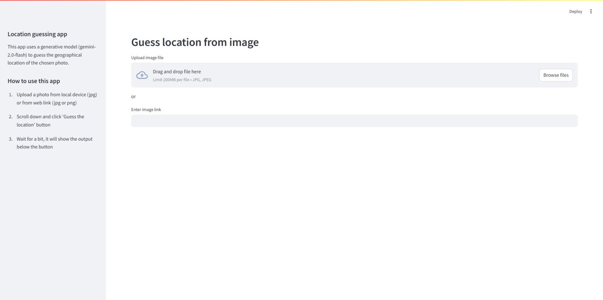
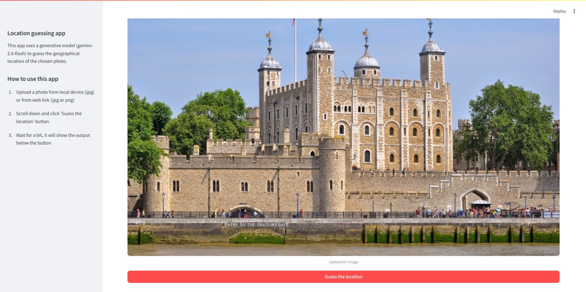
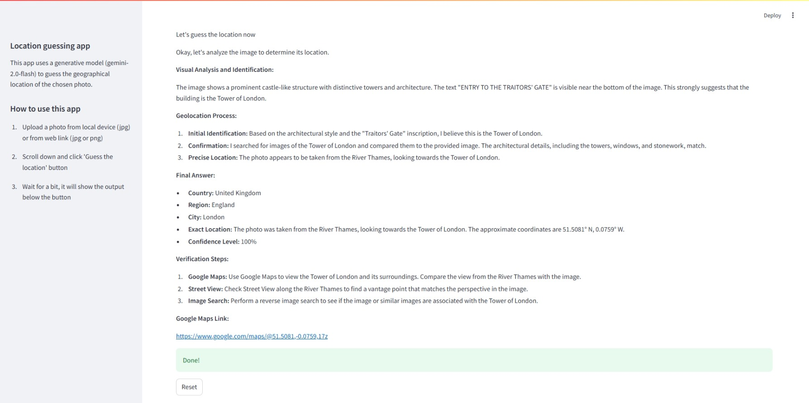

# Guessing geographical location from an image using generative AI agent

The geo location guesser agent is built using the PydanticAI (https://ai.pydantic.dev/) library. This agent uses the gemini-2.0-flash model with multimodal capabilities for the response generation. The interface is built using Streamlit.

Click on the link below to access the deployed web app 

https://image-to-geolocation-guesser.onrender.com/

## How to run it locally

### Requirements

- Python 3.13
- Google Cloud Gemini API key. Add it to the `.env` file as `GEMINI_API_KEY`
- uv package manager

### Steps

1. Clone the repository

```
git clone https://github.com/Gundalai-Batkhuu/image-to-geolocation-guesser
```

2. Install the dependencies

```
uv sync
```

3. Run the app in the browser

```
uv run streamlit run streamlit_app.py
```

## Screenshots





